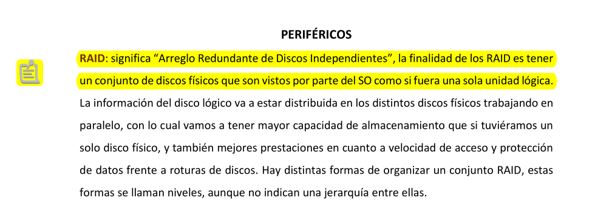
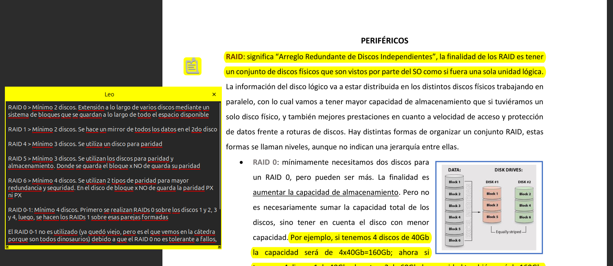

#### Estos resumenes no son hechos por mí, sino que fueron modificados con lo que creí necesario para poder compeltar bien con todos los temas.

Desconozco con otros lectores de PDFs, pero con el nativo de Ubuntu se puede apreciar bien la forma en la que realizo comentarios para correcciones.

Al costado de cada anotación que quise hacer sale un post-it. Al presionarlo se abrirá las notas o correcciones que quise hacer:

