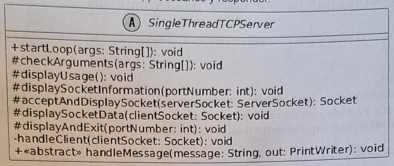

Consideremos una parte del framework SingleThreadTCPServer que permite construir servidores TCP en Java. El framework define el método handleClient que se encarga de leer los mensajes que envía el cliente, procesarlos y responder.



```java
private final void handleClient(Socket clientSocket) {
    try {
        PrintWriter out = new PrintWriter(clientSocket.getOutputScream(), true):
        BufferedReader in = new BufferedReader(
            new InputStreamReader(clientSocket.getInputStream());
        )

        String line;
        while((line = in.readLine()) != null) {
            System.out.println("Received message: " + inputLine
                + " from " + clientSocket.getInetAddress().getHostAddress()
                + ": " + clientSocket.getPort()
            );

            if(line.isEmpty()) break;
            this.handleMessage(line, out);
        }

        System.out.println("Connection closed with " + clientSocket.getInetAddress().getHostAddress() + ": " + clientSocket.getPort());
    } catch(IOException e) {
        System.err.println("Error: " + e.getMessage());
    } finally {
        try {
            clientSocket.close();
        } catch(IOException ignored) {}
    }
}
```

Tareas (debe realizar los cuatro items para aprobar el tema):

1. Explique brevemente cuáles son los frozen spot y hot spot del código presentado del framework.
2. Modificar este framework para permitir personalizar los mensajes que se muestran en consola por defecto cuando un cliente se conecta y se desconecta.
3. Explique brevemente cuáles son los frozen spot y hot spot después de la extensión realizada.
4. Indique en dónde se produce la inversión de control en la extensión realizada.

1) Los frozen spots del código presentado son los métodos que no se pueden modificar, en correspondería con el método no abstracto y final mostrado, handleClient.

>En Discord me tiraste que generalmente son Final, si bien tiene sentido, está bien decir que hay Frozen Spot que no lo son? Como por ejemplo el método del UML checkArguments

>Es válido decir que las cosas que no corresponden al Framework sino a Java son forzen spot? Técnicamente lo son, pero no tengo idea de si son final

Los hot spots son los métodos que se pueden modificar y reemplazar con lógica propia (abstractos o de interfaz), como es el caso de handleMessage.

>Si se hace un override de un método no abstracto, se considera un hot spot para ese escenario específico?

2) Deberíamos implementar dos nuevos métodos abstractos en el código y UML para permitir la extensión y, por consecuencia, la personalización de los mensajes.

```java
private final void handleClient(Socket clientSocket) {
    try {
        PrintWriter out = new PrintWriter(clientSocket.getOutputScream(), true):
        BufferedReader in = new BufferedReader(
            new InputStreamReader(clientSocket.getInputStream());
        )

        String line;
        while((line = in.readLine()) != null) {
            this.connectionMessage(); // primer cambio

            if(line.isEmpty()) break;
            this.handleMessage(line, out);
        }

        this.disconnectionMessage(); // segundo cambio
    } catch(IOException e) {
        System.err.println("Error: " + e.getMessage());
    } finally {
        try {
            clientSocket.close();
        } catch(IOException ignored) {}
    }
}
```

3) El único frozen spot en el código, nuevamente, es handleClient, mientras que ahora, los hot spots son handleMessage, connectionMessage y disconnectionMessage.

4) La inversión de control se da al realizar la invocación a los 3 métodos abstractos, ya que la lógica implementada depende totalmente de lo que haya hecho el programado, no del framework.