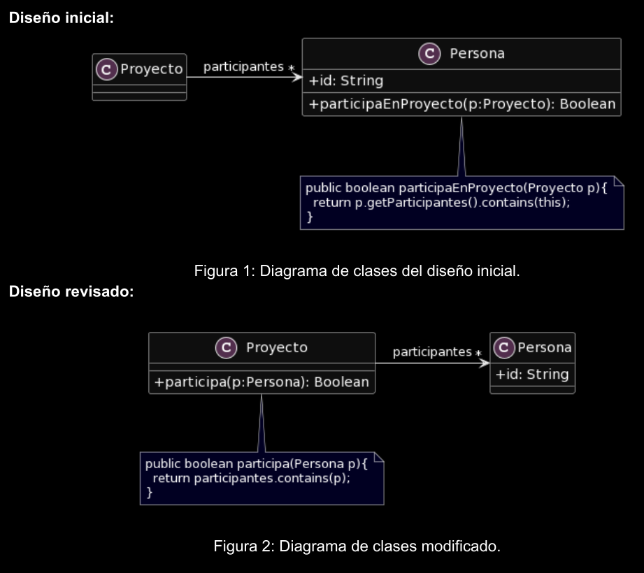

# Ejercicio 1: Algo huele mal
### Indique qué malos olores se presentan en los siguientes ejemplos.​

## 1.2 Participación en proyectos
### Al revisar el siguiente diseño inicial (Figura 1), se decidió realizar un cambio para evitar lo que se consideraba un mal olor. El diseño modificado se muestra en la Figura 2. Indique qué tipo de cambio se realizó y si lo considera apropiado. Justifique su respuesta.

Malos olores:

- Envidia de atributos
- Clase anémica (Proyecto) > Move Method
- Romper el encapsulamiento

También podríamos agregar que la delegación de tareas está mal. No es responsabilidad de "Persona" indicar si se encuentra en un proyecto o no.