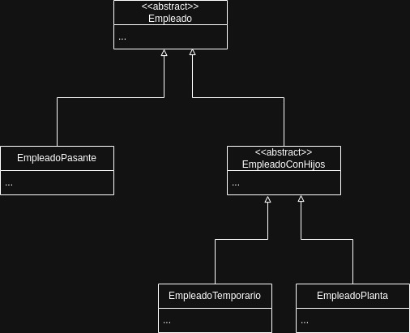

# Ejercicio 2

### Para cada una de las siguientes situaciones, realice en forma iterativa los siguientes pasos:
#### (i) indique el mal olor,
#### (ii) indique el refactoring que lo corrige,
#### (iii) aplique el refactoring, mostrando el resultado final (código y/o diseño según corresponda).
### Si vuelve a encontrar un mal olor, retorne al paso (i).

## 2.1 Empleados
##### Asumo que los constructores correspondientes a cada clase se encuentran dentro del [...]. Caso contrario, se deberían agregar para instanciar las variables y la super-clase.

```java
public class EmpleadoTemporario {
    public String nombre;
    public String apellido;
    public double sueldoBasico = 0;
    public double horasTrabajadas = 0;
    public int cantidadHijos = 0;
    
    // ......

    public double sueldo() {
        return this.sueldoBasico +​ (this.horasTrabajadas * 500) +​ (this.cantidadHijos * 1000) -​ (this.sueldoBasico * 0.13);
    }
}

public class EmpleadoPlanta {
    public String nombre;
    public String apellido;
    public double sueldoBasico = 0;
    public int cantidadHijos = 0;
    
    // ......

    public double sueldo() {
        return this.sueldoBasico + (this.cantidadHijos * 2000) - (this.sueldoBasico * 0.13);
    }
}

public class EmpleadoPasante {
    public String nombre;
    public String apellido;
    public double sueldoBasico = 0;
    
    // ......

    public double sueldo() {
        return this.sueldoBasico - (this.sueldoBasico * 0.13);
    }
}
```

Primer bad smell: Duplicated Code
Solución: Extract Superclass > Crear una clase abstracta "Empleado" con los campos que se encuentran duplicados en las sub-clases, también podemos definir el método abstracto "sueldo", para asegurar que todas las sub-clases lo definan con su propia implementación.

```java
public abstract class Empleado {
    public String nombre;
    public String apellido;
    public double sueldoBasico = 0;

    public Empleado(String nombre, String apellido, double sueldoBasico) {
        this.nombre = nombre;
        this.apellido = apellido;
        this.sueldoBasico = sueldoBasico;
    }

    public abstract double sueldo();
}

public class EmpleadoTemporario extends Empleado {
    public double horasTrabajadas = 0;
    public int cantidadHijos = 0;
    
    // ......

    public double sueldo() {
        return this.sueldoBasico +​ (this.horasTrabajadas * 500) +​ (this.cantidadHijos * 1000) -​ (this.sueldoBasico * 0.13);
    }
}

public class EmpleadoPlanta {
    public int cantidadHijos = 0;
    
    // ......

    public double sueldo() {
        return this.sueldoBasico + (this.cantidadHijos * 2000) - (this.sueldoBasico * 0.13);
    }
}

public class EmpleadoPasante {
    // ......

    public double sueldo() {
        return this.sueldoBasico - (this.sueldoBasico * 0.13);
    }
}
```

Segundo bad smell: Rompe con el encapsulamiento
Solución: Encapsulate Field > Hacer todas las propiedades privadas y proporcionar getters y setters para su utilización al exterior.

```java
public abstract class Empleado {
    private String nombre;
    private String apellido;
    private double sueldoBasico = 0;

    public Empleado(String nombre, String apellido, double sueldoBasico) {
        this.nombre = nombre;
        this.apellido = apellido;
        this.sueldoBasico = sueldoBasico;
    }

    public String getNombre() {
        return this.nombre;
    }

    public void setNombre(string nombre) {
        this.nombre = nombre;
    }

    public String getApellido() {
        return this.apellido;
    }

    public void setApellido(String apellido) {
        this.apellido = apellido;
    }

    public double getSueldoBasico() {
        return this.sueldoBasico;
    }

    public void setSueldoBasico(double sueldoBasico) {
        this.sueldoBasico = sueldoBasico;
    }

    public abstract double sueldo();
}

public class EmpleadoTemporario extends Empleado {
    private double horasTrabajadas = 0;
    private int cantidadHijos = 0;
    
    // ......

    public double sueldo() {
        return this.sueldoBasico +​ (this.horasTrabajadas * 500) +​ (this.cantidadHijos * 1000) -​ (this.sueldoBasico * 0.13);
    }

    public double getHorasTrabajadas() {
        return this.horasTrabajadas;
    }

    public void setHorasTrabajadas(double horasTrabajadas) {
        this.horasTrabajadas = horasTrabajadas;
    }

    public int getCantidadHijos() {
        return this.cantidadHijos;
    }

    public void setCantidadHijos(int cantidadHijos) {
        this.cantidadHijos = cantidadHijos;
    }
}

public class EmpleadoPlanta {
    private int cantidadHijos = 0;
    
    // ......

    public double sueldo() {
        return this.sueldoBasico + (this.cantidadHijos * 2000) - (this.sueldoBasico * 0.13);
    }

    public int getCantidadHijos() {
        return this.cantidadHijos;
    }

    public void setCantidadHijos(int cantidadHijos) {
        this.cantidadHijos = cantidadHijos;
    }
}

public class EmpleadoPasante {
    
    // ......

    public double sueldo() {
        return this.sueldoBasico - (this.sueldoBasico * 0.13);
    }
}
```

#### <b>Consultas:</b> 

1) Es demasiado crear la clase extra para "cantidadHijos"? Si bien es una propiedad duplicada entre dos clases, no sé si vale la pena (en este caso) la creación de otra clase de la cual hereden "EmpleadoTemporario" y "EmpleadoPlanta".



2) Es necesario marcar como refactor la eliminación del setter de Nombre y Apellido? Lo vi en soluciones de otras personas.

3) Es correcto suponer que dispongo de los constructores? Al estar resumido el inicio del código, yo entiendo que hay más cosas declaradas y hechas previo al método "sueldo".

4) Se considera un nombre poco claro el nombre del método "sueldo"?