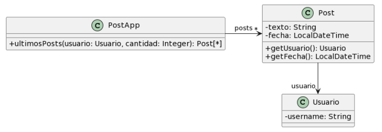

# Ejercicio 2

### Para cada una de las siguientes situaciones, realice en forma iterativa los siguientes pasos:
#### (i) indique el mal olor,
#### (ii) indique el refactoring que lo corrige,
#### (iii) aplique el refactoring, mostrando el resultado final (código y/o diseño según corresponda).
### Si vuelve a encontrar un mal olor, retorne al paso (i).

## 2.3 Publicaciones



```java
/**
* Retorna los últimos N posts que no pertenecen al usuario user
*/
public List<Post> ultimosPosts(Usuario user, int cantidad) {
    List<Post> postsOtrosUsuarios = new ArrayList<Post>();
    for (Post post : this.posts) {
        if (!post.getUsuario().equals(user)) {
            postsOtrosUsuarios.add(post);
        }
    }

    // ordena los posts por fecha
    for (int i = 0; i < postsOtrosUsuarios.size(); i++) {
        int masNuevo = i;
        for(int j= i +1; j < postsOtrosUsuarios.size(); j++) {
            if (postsOtrosUsuarios.get(j).getFecha().isAfter(postsOtrosUsuarios.get(masNuevo).getFecha())) {
            masNuevo = j;
            }
        }

        Post unPost = postsOtrosUsuarios.set(i,postsOtrosUsuarios.get(masNuevo));
        postsOtrosUsuarios.set(masNuevo, unPost);
    }

    List<Post> ultimosPosts = new ArrayList<Post>();
    int index = 0;
    Iterator<Post> postIterator = postsOtrosUsuarios.iterator();
    
    while (postIterator.hasNext() && index < cantidad) {
        ultimosPosts.add(postIterator.next());
    }
    
    return ultimosPosts;
}
```

Primer bad smell: Long Method.
Solución: Extract Method > Separar el método ultimosPosts en varios métodos más chicos que sean independientes, de esta manera se están delegando las responsabilidades permitiendo reutilizar el código en caso de ser necesario.

```java
private List<Posts> postsSinUsuario(Usuario user) {
    List<Post> postsOtrosUsuarios = new ArrayList<Post>();

    for (Post post : this.posts) {
        if (!post.getUsuario().equals(user)) {
            postsOtrosUsuarios.add(post);
        }
    }

    return postsOtrosUsuarios;
}

private List<Post> ordenarPorFecha(List<Post> postOtrosUsuarios) {
    List<Post> postsOrdenados = new ArrayList<Post>();

    for (int i = 0; i < postsOtrosUsuarios.size(); i++) {
        int masNuevo = i;
        for(int j= i +1; j < postsOtrosUsuarios.size(); j++) {
            if (postsOtrosUsuarios.get(j).getFecha().isAfter(postsOtrosUsuarios.get(masNuevo).getFecha())) {
            masNuevo = j;
            }
        }

        Post unPost = postsOtrosUsuarios.set(i,postsOtrosUsuarios.get(masNuevo));
        postsOtrosUsuarios.set(masNuevo, unPost);
    }

    return postsOrdenados;
}

private List<Post> obtenerUltimos(List<Posts> postsOtrosUsuarios, int cantidad) {
    List<Post> ultimosPosts = new ArrayList<Post>();
    int index = 0;
    Iterator<Post> postIterator = postsOtrosUsuarios.iterator();
    
    while (postIterator.hasNext() && index < cantidad) {
        ultimosPosts.add(postIterator.next());
    }

    return ultimosPosts;
}

/**
* Retorna los últimos N posts que no pertenecen al usuario user
*/
public List<Post> ultimosPosts(Usuario user, int cantidad) {

    List<Post> postsOtrosUsuarios = this.postsSinUsuario(user);
    postsOtrosUsuarios = this.ordenarPorFecha(postsOtrosUsuarios);

    List<Post> ultimosPosts = this.obtenerUltimos(postsOtrosUsuarios, cantidad);
    
    return ultimosPosts;
}
```

<u><b>Corrección del ayudante</b></u>: Lo ideal es llevar a la mínima expresión el refactor, es decir, Extract Method debería ser responsable de extraer UN solo método, por lo tanto, lo correcto sería realizar 3 veces Extract Method para llegar al resultado esperado.
También agregó que en un parcial en papel esto no tiene sentido, lo mejor sería hacer como hice, un Extract Method que saque los 3 en un solo paso, pero debería estar bien aclarado que sé cómo funciona el método y que debería hacerlo por pasos, pero por temas de tiempo lo hago todo en uno.

Segundo bad smell: Reinventar la rueda.
Solución: Modificar las estructuras for por Streams.

```java
private List<Posts> postsSinUsuario(Usuario user) {
    return this.posts.stream().filter(post -> !post.getUser().equals(user)).collect(Collectors.toList());
}

private List<Post> ordenarPorFecha(List<Post> postOtrosUsuarios) {
    return postsOtrosUsuarios.stream().sorted((p2, p1) -> p1.getFecha().compareTo(p2.getFecha())).collect(Collectors.toList());
}

private List<Post> obtenerUltimos(List<Posts> postsOtrosUsuarios, int cantidad) {
    return postsOtrosUsuarios.stream().limit(cantidad).collect(Collectors.toList());
}

/**
* Retorna los últimos N posts que no pertenecen al usuario user
*/
public List<Post> ultimosPosts(Usuario user, int cantidad) {

    List<Post> postsOtrosUsuarios = this.postsSinUsuario(user);
    postsOtrosUsuarios = this.ordenarPorFecha(postsOtrosUsuarios);

    List<Post> ultimosPosts = this.obtenerUltimos(postsOtrosUsuarios, cantidad);
    
    return ultimosPosts;
}
```

Tercer bad smell: Rompe el encapsulamiento.
Solución: Hacer la variable posts privada.


### <b>Consultas:</b>

1) ¿Está bien la utilización de Streams? No los uso hace bastante, me gustaría corroborar.

<b>Respuesta del ayudante</b>: Sí, el único comentario es que se están ordenando al revés, al utilizar ```.sorted((p1, p2) -> p1.getFecha().compareTo(p2.getFecha()))``` se están ordenando de menor a mayor, por lo tanto el limit devuelve los N Posts más viejos.
Único cambio necesario es utilizar ```.sorted((p2, p1) -> p1.getFecha().compareTo(p2.getFecha()))```.

2) ¿En Java no especificar la protección lo hace por defecto Public o Private?

<b>Respuesta del ayudante</b>: Public.