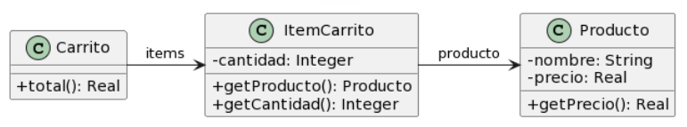

# Ejercicio 2

### Para cada una de las siguientes situaciones, realice en forma iterativa los siguientes pasos:
#### (i) indique el mal olor,
#### (ii) indique el refactoring que lo corrige,
#### (iii) aplique el refactoring, mostrando el resultado final (código y/o diseño según corresponda).
### Si vuelve a encontrar un mal olor, retorne al paso (i).

## 2.4 Carrito de compras



```java
public class Producto {
    private String nombre;
    private double precio;

    public double getPrecio() {
        return this.precio; 
    }
}

public class ItemCarrito {
    private Producto producto;
    private int cantidad;

    public Producto getProducto() {
        return this.producto;
    }
    public int getCantidad() {
        return this.cantidad;
    }

    public double getPrecioTotal() {
        return this.producto.getPrecio() * this.cantidad(); 
    }
}

public class Carrito {
    private List<ItemCarrito> items;

    public double total() {
        return this.items.stream().mapToDouble(item -> item.getPrecioTotal()).sum();
    }
}
```


### <b>Consultas:</b>

1) No le encuentro nada REALMENTE malo ni refactorizable, es decir, sí veo que hay básicamente 2 data/lazy class, pero por un motivo de expresividad y claridad en el ejercicio no veo mal que estén.
Se me ocurre que se podría almacenar la cantidad directamente sobre el producto o algo por el estilo, permitiendo ahrorar ItemCarrito, pero aún así entiendo que representan cosas distintas.
También se podría almacenar una tupla con (cantidad, producto), pero llegamos a algo similar. ¿Asumo que la idea es utilizar un Set?

<b>Respuesta del ayudante</b>: Estoy de acuerdo con la expresividad del ejercicio, no veo que nada sea necesario refactorizar en términos de clases.
La utilización de un Set PODRÍA alterar el comportamiento, dependiendo el uso que se le de, al ser tan simple el ejercicio es difícil de deducir, es mejor no modificarlo.

2) ¿Pasamano de mensajes en el Stream? <b>.getProducto().getPrecio()</b>
Se me ocurre, manteniendo la estructura del programa actual, poner un método getPrecio() en el ItemCarrito y que ese me devuelva el precio del producto.

<b>Respuesta del ayudante</b>: Sí, el único problema en este ejercicio es el Feature Envy.