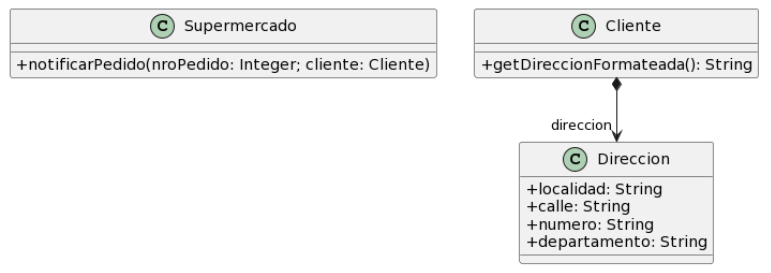
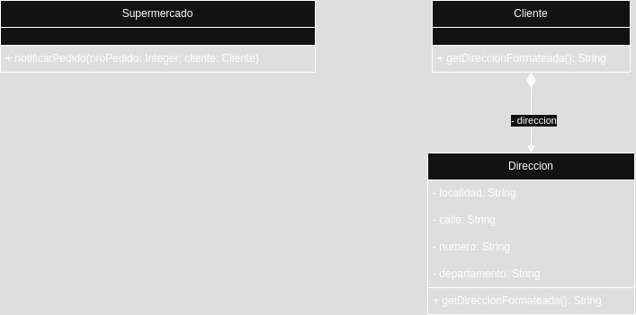

# Ejercicio 2

### Para cada una de las siguientes situaciones, realice en forma iterativa los siguientes pasos:
#### (i) indique el mal olor,
#### (ii) indique el refactoring que lo corrige,
#### (iii) aplique el refactoring, mostrando el resultado final (código y/o diseño según corresponda).
### Si vuelve a encontrar un mal olor, retorne al paso (i).

## 2.5 Envío de pedidos



```java
public class Supermercado {

    public void notificarPedido(long nroPedido, Cliente cliente) {
        String notificacion = MessageFormat.format(“Estimado cliente, se le informa que hemos recibido su pedido con número {0}, el cual será enviado a la dirección {1}”, new Object[] { nroPedido, cliente.getDireccionFormateada() });
        // lo imprimimos en pantalla, podría ser un mail, SMS, etc..
        System.out.println(notificacion);
    }
}

public class Cliente {
    public String getDireccionFormateada() {
        return this.direccion.getLocalidad() + “, ” + this.direccion.getCalle() + “, ” + this.direccion.getNumero() + “, ” + this.direccion.getDepartamento();
    }
}
```

Siento que me falta una clase Pedido, la cual sea la encargada de enviar el Mensaje, me suena raro que Supermercado sea quien lo envía, como si fuese una mala asignación de responsabilidades.

<u><b>Corrección del ayudante</b></u>: La clase Supermercado es totalmente innecesaria y debe ser ignorada en este ejercicio. Problema de la cátedra al plantearlo, modifica el foco de lo que realmente se quiere ver.

En base a lo que me explicó el ayudante en la consulta:

Primer bad smell: Feature Envy.
Solución: Mover la responsabilidad del formateo de la dirección a la clase Dirección, quien es la que realmente debería hacerlo.

```java
public class Supermercado {

    public void notificarPedido(long nroPedido, Cliente cliente) {
        String notificacion = MessageFormat.format(“Estimado cliente, se le informa que hemos recibido su pedido con número {0}, el cual será enviado a la dirección {1}”, new Object[] { nroPedido, cliente.getDireccionFormateada() });
        // lo imprimimos en pantalla, podría ser un mail, SMS, etc..
        System.out.println(notificacion);
    }
}

public class Cliente {
    public String getDireccionFormateada() {
        return this.direccion.getDireccionFormateada();
    }
}

public class Direccion {
    
    // ...

    public String getDireccionFormateada() {
        return this.localidad + “, ” + this.calle + “, ” + this.numero + “, ” + this.departamento;
    }
}
```

Segundo bad smell: Rompe el encapsulamiento
Solución: MOdificar todas las variables públicas a privadas, proveer getters y setters para poder garantizar el acceso desde lugares externos y actualizar todas las referencias para que el programa siga funcionando correctamente.



### <b>Consultas:</b>

1) El rombo lleno en la flecha de Cliente a Dirección era que si se elimina el Cliente se elimina la dirección asociada, ¿no? (¿Composición?).

<b>Respuesta del ayudante</b>: Sí.
