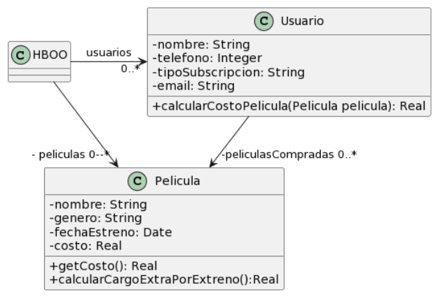

# Ejercicio 2

### Para cada una de las siguientes situaciones, realice en forma iterativa los siguientes pasos:
#### (i) indique el mal olor,
#### (ii) indique el refactoring que lo corrige,
#### (iii) aplique el refactoring, mostrando el resultado final (código y/o diseño según corresponda).
### Si vuelve a encontrar un mal olor, retorne al paso (i).

## 2.6 Películas



```java
public class Usuario {
    String tipoSubscripcion;
   
    // ...
   
    public void setTipoSubscripcion(String unTipo) {
        this.tipoSubscripcion = unTipo;
    }
  
    public double calcularCostoPelicula(Pelicula pelicula) {
        ​double costo = 0;
        ​if (tipoSubscripcion == "Basico") {
        ​   costo = pelicula.getCosto() + pelicula.calcularCargoExtraPorEstreno();
        ​}
        else if (tipoSubscripcion == "Familia") {
        ​   costo = (pelicula.getCosto() + pelicula.calcularCargoExtraPorEstreno()) * 0.90;
        ​}
        ​else if (tipoSubscripcion == "Plus") {
        ​   costo = pelicula.getCosto();
        ​}
        ​else if (tipoSubscripcion == "Premium") {
        ​   costo = pelicula.getCosto() * 0.75;
        ​}

        ​return costo;
    }
}

public class Pelicula {
    LocalDate fechaEstreno;
    
    // ...
    
    public double getCosto() {
        return this.costo;
    }

    public double calcularCargoExtraPorEstreno(){
        // Si la Película se estrenó 30 días antes de la fecha actual, retorna un cargo de 0$, caso contrario, retorna un cargo extra de 300$
        ​return (ChronoUnit.DAYS.between(this.fechaEstreno, LocalDate.now()) ) > 30 ? 0 : 300;
    }
}
```

Primer bad smell: Switch Statements
Solución: Replace Conditional with Polymorphism > En este escenario tenemos que eliminar los condicionales dentro de la clase Usuario relacionados a la suscripción. Se plantea mover la lógica a una jerarquía para que el código quede mucho más limpio y libre de condicionales.

```java
public interface Suscripcion {

    public double calcularCosto(Pelicula pelicula);

}

public class SuscripcionBasica extends Suscripcion {

    public double calcularCosto(Pelicula pelicula) {
        return pelicula.getCosto() + pelicula.calcularCargoExtraPorEstreno();
    }

}

public class SuscripcionFamiliar extends Suscripcion {

    public double calcularCosto(Pelicula pelicula) {
        return (pelicula.getCosto() + pelicula.calcularCargoExtraPorEstreno()) * 0.90;
    }

}

public class SuscripcionPlus extends Suscripcion {

    public double calcularCosto(Pelicula pelicula) {
        return pelicula.getCosto();
    }

}

public class SuscripcionPremium extends Suscripcion {

    public double calcularCosto(Pelicula pelicula) {
        return pelicula.getCosto() * 0.75;
    }

}

public class Usuario {
    Suscripcion tipoSubscripcion;
   
    // ...
   
    public void setTipoSubscripcion(Suscripcion unTipo) {
        this.tipoSubscripcion = unTipo;
    }
  
    public double calcularCostoPelicula(Pelicula pelicula) {
        ​return this.suscripcion.calcularCosto(pelicula);
    }
}

public class Pelicula {
    LocalDate fechaEstreno;
    
    // ...
    
    public double getCosto() {
        return this.costo;
    }

    public double calcularCargoExtraPorEstreno(){
        // Si la Película se estrenó 30 días antes de la fecha actual, retorna un cargo de 0$, caso contrario, retorna un cargo extra de 300$
        ​return (ChronoUnit.DAYS.between(this.fechaEstreno, LocalDate.now()) ) > 30 ? 0 : 300;
    }
}
```

Segundo bad smell: Duplicated Code + Feature Envy.
Solución: Extract Method > Se puede extraer un método de las suscripciones para que la Película sea quien calcular el precio más el cargo extra por estreno. De esta manera evitamos generar un pasamanos de mensajes y que se duplique el cálculo dentro de los distintos tipos de suscripción.

```java
public interface Suscripcion {

    public double calcularCosto(Pelicula pelicula);

}

public class SuscripcionBasica extends Suscripcion {

    public double calcularCosto(Pelicula pelicula) {
        return pelicula.calcularCostoTotal();
    }

}

public class SuscripcionFamiliar extends Suscripcion {

    public double calcularCosto(Pelicula pelicula) {
        return pelicula.calcularCostoTotal() * 0.90;
    }

}

public class SuscripcionPlus extends Suscripcion {

    public double calcularCosto(Pelicula pelicula) {
        return pelicula.getCosto();
    }

}

public class SuscripcionPremium extends Suscripcion {

    public double calcularCosto(Pelicula pelicula) {
        return pelicula.getCosto() * 0.75;
    }

}

public class Usuario {
    Suscripcion tipoSubscripcion;
   
    // ...
   
    public void setTipoSubscripcion(Suscripcion unTipo) {
        this.tipoSubscripcion = unTipo;
    }
  
    public double calcularCostoPelicula(Pelicula pelicula) {
        ​return this.suscripcion.calcularCosto(pelicula);
    }
}

public class Pelicula {
    LocalDate fechaEstreno;
    
    // ...
    
    public double getCosto() {
        return this.costo;
    }

    public double calcularCargoExtraPorEstreno(){
        // Si la Película se estrenó 30 días antes de la fecha actual, retorna un cargo de 0$, caso contrario, retorna un cargo extra de 300$
        ​return (ChronoUnit.DAYS.between(this.fechaEstreno, LocalDate.now()) ) > 30 ? 0 : 300;
    }

    public double calcularCostoTotal() {
        return this.costo + this.calcularCargoExtraPorEstreno();
    }
}
```

Tercer bad smell: Rompe el encapsulamiento.
Solución: Pasar todas las variables que se disponen a privadas, proveer getters y setters para permitir el acceso desde fuera de la clase y reemplazar todas las referencias necesarias para que el programa funcione correctamente.

```java
public interface Suscripcion {

    public double calcularCosto(Pelicula pelicula);

}

public class SuscripcionBasica extends Suscripcion {

    public double calcularCosto(Pelicula pelicula) {
        return pelicula.calcularCostoTotal();
    }

}

public class SuscripcionFamiliar extends Suscripcion {

    public double calcularCosto(Pelicula pelicula) {
        return pelicula.calcularCostoTotal() * 0.90;
    }

}

public class SuscripcionPlus extends Suscripcion {

    public double calcularCosto(Pelicula pelicula) {
        return pelicula.getCosto();
    }

}

public class SuscripcionPremium extends Suscripcion {

    public double calcularCosto(Pelicula pelicula) {
        return pelicula.getCosto() * 0.75;
    }

}

public class Usuario {
    private Suscripcion tipoSubscripcion;
   
    // ...

    public Suscripcion getTipoSuscripcion() {
        return this.tipoSuscripcion;
    }
   
    public void setTipoSubscripcion(Suscripcion unTipo) {
        this.tipoSubscripcion = unTipo;
    }
  
    public double calcularCostoPelicula(Pelicula pelicula) {
        ​return this.suscripcion.calcularCosto(pelicula);
    }
}

public class Pelicula {
    private LocalDate fechaEstreno;
    
    // ...

    public LocalDate getFechaEstreno() {
        return this.fechaEstreno;
    }

    public void setLocalDate(LocalDate fechaEstreno) {
        this.fechaEstreno = fechaEstreno;
    }
    
    public double getCosto() {
        return this.costo;
    }

    public double calcularCargoExtraPorEstreno(){
        // Si la Película se estrenó 30 días antes de la fecha actual, retorna un cargo de 0$, caso contrario, retorna un cargo extra de 300$
        ​return (ChronoUnit.DAYS.between(this.fechaEstreno, LocalDate.now()) ) > 30 ? 0 : 300;
    }

    public double calcularCostoTotal() {
        return this.costo + this.calcularCargoExtraPorEstreno();
    }
}
```

### <b>Consultas:</b>

1) En el segundo bad smell, ¿podría cambiar el método calcularCargoExtraPorEstreno de public a private?
Desconozco si en alguna otra parte del código se accede debido a que tengo una implementación reducida, pero en lo que tengo, este no es vuelto a usar y quedaría mejor como un método privado.

