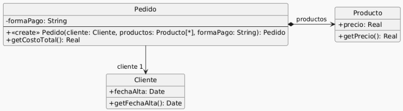
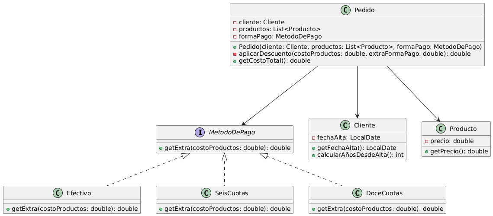

# Ejercicio 4

### Se tiene el siguiente modelo de un sistema de pedidos y la correspondiente implementación.



```java
public class Pedido {
    private Cliente cliente;
    private List<Producto> productos;
    private String formaPago;

    public Pedido(Cliente cliente, List<Producto> productos, String formaPago) {
        if (!"efectivo".equals(formaPago)
                && !"6 cuotas".equals(formaPago)
                && !"12 cuotas".equals(formaPago)) {
            throw new Error("Forma de pago incorrecta");
        }

        this.cliente = cliente;
        this.productos = productos;
        this.formaPago = formaPago;
    }

    public double getCostoTotal() {
        double costoProductos = 0;
        for (Producto producto : this.productos) {
            costoProductos += producto.getPrecio();
        }

        double extraFormaPago = 0;
        if ("efectivo".equals(this.formaPago)) {
            extraFormaPago = 0;
        } else if ("6 cuotas".equals(this.formaPago)) {
            extraFormaPago = costoProductos * 0.2;
        } else if ("12 cuotas".equals(this.formaPago)) {
            extraFormaPago = costoProductos * 0.5;
        }

        int añosDesdeFechaAlta = Period.between(this.cliente.getFechaAlta(),
                LocalDate.now()).getYears();
        // Aplicar descuento del 10% si el cliente tiene más de 5 años de antiguedad
        if (añosDesdeFechaAlta > 5) {
            return (costoProductos + extraFormaPago) * 0.9;
        }

        return costoProductos + extraFormaPago;
    }
}

public class Cliente {
    private LocalDate fechaAlta;

    public LocalDate getFechaAlta() {
        return this.fechaAlta;
    }
}

public class Producto {
    private double precio;

    public double getPrecio() {
        return this.precio;
    }
}
```

## Tareas:
### 1.​ Dado e​l código anterior, aplique únicamente los siguientes refactoring:
#### - Replace Loop with Pipeline (líneas 16 a 19)
#### - Replace Conditional with Polymorphism (líneas 21 a 27)
#### - Extract method y move method (línea 28)
#### - Extract method y replace temp with query (líneas 28 a 33)

#### Primer refactor:

```java
double costoProductos = this.productos.stream().mapToDoube(producto -> producto.getPrecio()).sum();
```

#### Segundo refactor: 

<b>Comentario del ayudante</b>: Está mal el enunciado, la idea es que también modifiques los constructores, ya que, si no lo hacés, al refactorizar se rompería el código y dejaría ser refactoring porque altera el funcionamiento.

```java
interface MetodoDePago {

    public double getExtra(double costoProductos);

}

public class Efectivo implements MetodoDepago {

    public double getExtra(double costoProductos) {
        return 0;
    }

}

public class SeisCuotas implements MetodoDePago {

    public double getExtra(double costoProductos) {
        return costoProductos * 0.2;
    }

}

public class DoceCuotas implements MetodoDePago {

    public double getExtra(double costoProductos) {
        return costoProductos * 0.5;
    }

}

public class Pedido {
    
    // . . .
    private MetodoDepago formaPago;

    public Pedido(Cliente cliente, List<Producto> productos, MetodoDePago formaPago) {

        this.cliente = cliente;
        this.productos = productos;
        this.formaPago = formaPago;
    }

    // . . .

    public double getCostoTotal() {

        // . . .

        double extraFormaPago = this.formaPago.calcularExtra(costoProductos);

        // . . .
    }
}

}
```

#### Tercer refactor:

```java
public class Cliente {
    private LocalDate fechaAlta;

    public LocalDate getFechaAlta() {
        return this.fechaAlta;
    }

    public int calcularAñosDesdeAlta() {
        return Period.between(this.fechaAlta(), LocalDate.now()).getYears();
    }
}
```

#### Cuarto refactor:

```java
private double aplicarDescuento(double costoProductos, double extraFormaPago) {
    return (costoProductos + extraFormaPago);
}

// Aplicar descuento del 10% si el cliente tiene más de 5 años de antiguedad
if (this.cliente.calcularAñosDesdeAlta() > 5) {
    return this.aplicarDescuento(costoProductos, extraFormaPago) * 0.9;
}

return this.aplicarDescuentos(costoProductos, extraFormaPago);
```

#### Resultado final:

```java
interface MetodoDePago {

    public double getExtra(double costoProductos);

}

public class Efectivo implements MetodoDepago {

    public double getExtra(double costoProductos) {
        return 0;
    }

}

public class SeisCuotas implements MetodoDePago {

    public double getExtra(double costoProductos) {
        return costoProductos * 0.2;
    }

}

public class DoceCuotas implements MetodoDePago {

    public double getExtra(double costoProductos) {
        return costoProductos * 0.5;
    }
    
}

public class Pedido {
    private Cliente cliente;
    private List<Producto> productos;
    private MetodoDepago formaPago;

    public Pedido(Cliente cliente, List<Producto> productos, MetodoDePago formaPago) {

        this.cliente = cliente;
        this.productos = productos;
        this.formaPago = formaPago;
    }

    private double aplicarDescuento(double costoProductos, double extraFormaPago) {
        return (costoProductos + extraFormaPago);
    }

    public double getCostoTotal() {

        double costoProductos = this.productos.stream().mapToDoube(producto -> producto.getPrecio()).sum();

        double extraFormaPago = this.formaPago.calcularExtra(costoProductos);

        // Aplicar descuento del 10% si el cliente tiene más de 5 años de antiguedad
        if (this.cliente.calcularAñosDesdeAlta() > 5) {
            return this.aplicarDescuento(costoProductos, extraFormaPago) * 0.9;
        }

        return this.aplicarDescuentos(costoProductos, extraFormaPago);
    }
}

public class Cliente {
    private LocalDate fechaAlta;

    public LocalDate getFechaAlta() {
        return this.fechaAlta;
    }

    public int calcularAñosDesdeAlta() {
        return Period.between(this.fechaAlta(), LocalDate.now()).getYears();
    }
}

public class Producto {
    private double precio;

    public double getPrecio() {
        return this.precio;
    }
}
```

### 2.​ Realice el diagrama de clases del código refactorizado.

