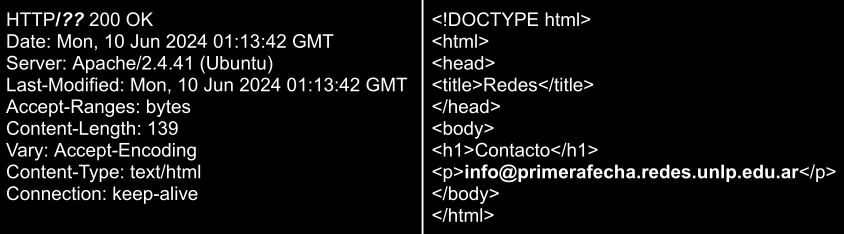
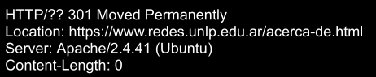
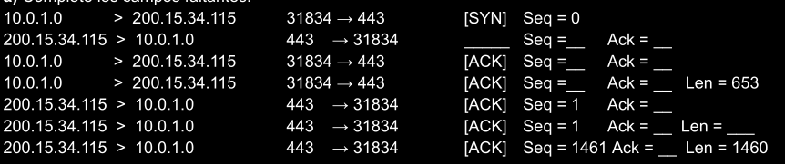
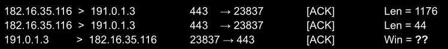

**1)**  Un cliente, desde su red doméstica, desea acceder al sitio **https://www.redes.unlp.edu.ar/contacto.html**.

**a)** Explique, paso a paso y en orden, cuáles son los mensajes de capa de aplicación que envía y recibe el cliente hasta poder acceder al sitio desde su navegador, sabiendo que la respuesta del servidor será la siguiente:

(NOTA: asuma que existe un DNS local. Usar valores ilustrativos donde sea necesario).



Lo primero es verificar si la consulta está resuelta en la caché local del dispositivo, al no estarlo se realiza una consulta DNS al servidor DNS local, quien retorna una respuesta con el registro A del dominio requerido.
Seguido a esto, se hace una solicitud HHTP GET para el recurso buscado y retorna lo esperado.

**b)** La respuesta que recibe el cliente desde el DNS local, ¿es autoritativa?, ¿es iterativa?

La respuesta no es autoritativa ya que el DNS local no es autoritativo, y la consulta fue recursiva.

**c)** En base a la respuesta obtenida en el anterior inciso.

**i.** ¿Qué versión de HTTP se usó?

Se utilizó la versión HTTP 1.1 debido a que el HOST está incluído en la respuesta y esta tag sólo existe en esta versión y es obligatoria.

**ii.** Complete la siguiente cabecera del requerimiento:

>**contacto.html** **GET** HTTP/**1.1**
>Host: **www.redes.unlp.edu.ar**

**d)** Sabiendo que el servidor DNS de **primerafecha.redes.unlp.edu.ar** tiene dos registros MX configurados, uno con prioridad 5 y otro con prioridad 6, si se quiere enviar un correo a un usuario con ese dominio.

(NOTA: asuma que el remitente usa un dominio distinto al destinatario).

**i.** ¿Cuál se usará primero para el envío del correo?

A menor sea el valor de prioridad, mayor prioridad tiene.

**ii.** ¿Debe el dominio del remitente tener configurado al menos un registro MX para poder enviar correos electrónicos?

Sí, el MTA del remitente solicita mediante una consulta DNS a su servidor local por el registro MX del dominio del destinatario, por lo que sí, es necesario que lo tenga configurado.

**e)** Supongamos que al realizar la solicitud **https://www.redes.unlp.edu.ar/contacto.html** se obtiene la cabecera que se muestra a continuación, ¿qué significa esta respuesta?



Significa que el recurso fue movido y se dejó constancia de eso con un código de respuesta 301. Ahora el recurso **/contacto.html** se encuentra en **/acerca-de.html**.

**2)** Teniendo en cuenta el punto anterior, usted es el administrador del dominio de DNS de redes.unlp.edu.ar. Considere agregar registros para servidores web, correo electrónico y las delegaciones de dominio necesarias. ¿Cómo quedarían los registros DNS en redes.unlp.edu.ar?

NOTA: indicar tipo de registro y contenido (nombre y valor) usando valores ilustrativos donde sea necesario.

```php
redes.unlp.edu.ar IN SOA ns1.redes.unlp.edu.ar
redes.unlp.edu.ar IN NS ns1.redes.unlp.edu.ar
ns1.redes.unlp.edu.ar IN A ...
www.redes.unlp.edu.ar IN A ...
redes.unlp.edu.ar IN MX mail.redes.unlp.edu.ar
mail.redes.unlp.edu.ar IN A ...
redes.unlp.edu.ar IN NS primerafecha.redes.unlp.edu.ar
primerafecha.redes.unlp.edu.ar IN A ...
```

**3)** Dada las siguientes capturas de tráfico:

**a)** Complete los campos faltantes:



>[SYN-ACK] Seq= 0 ACK= 1
>[ACK] Seq= 1 ACK= 1
>[ACK] Seq= 1 ACK= 1
>[ACK] Seq= 1 ACK= 1 Len= 653
>[ACK] Seq= 1 ACK= 654
>[ACK] Seq= 1 ACK= 654 Len= 1460
>[ACK] Seq= 1461 ACK= 654 Len= 1460

**b)** Supongamos que tenemos luego:



**i.** Antes de recibir los 1176 bytes, el cliente (191.0.1.3) informa una ventana de recepción con disponibilidad de 2000 bytes. Suponiendo que el cliente no consume ningún dato del buffet, indicar el tamaño final de ventana del cliente luego de enviar el último ACK.

780 bytes.

**ii.** Si el servidor hubiera recibido que la ventana de recepción del cliente tiene una disponibilidad de 0 bytes en vez de 2000 bytes, antes de que pueda enviar los 1176 bytes, ¿qué hubiera pasado? ¿Cuál mecanismo es el que actúa, control de congestión o de flujo?

El receptor notifica que tiene su buffer lleno, por lo que el emisor deja de enviar paquetes y se inicia el control de flujo.

**5)** En base a la información del punto anterior.

**a)** Si el Router D tuviese como default gateway a ```10.10.20.14``` por la interfaz ```eth2```, ¿qué pasaría con los paquetes que envía una PC en la Red E a Internet?

Si el Router D tuviese como Default Gateway esa IP por la interfaz ```eth2```, cuando Router C envía un paquete se envía desde la Red E, este debe pasar inicialmente por el Router C (Next Hop), y este lo enviará para Router D para que siga su recorrido.
Al llegar al Router D, este analizará su tabla de ruteo, verá que no tiene configurada una salida hacia la IP Destino y lo enviará por la default gateway de nuevo al Router C, donde iniciará un bucle de envíos hasta que el TTL se venza.

**b)** Si Router B no conoce la red ```200.10.10.0/30```, ¿podrá enviar y recibir paquetes hacia y desde Internet?

Sí, este podría hacerlo ya que, si todos los routers están bien configurados, mediante las Default Gateway debería ser posible la entrega.

**c)** Servidor-E se encuentra con el puerto ```80/TCP``` en estado ```LISTEN```. Suponga que la red ```10.10.20.12/30``` se cae y PC-A envía un ```SYN``` a Servidor-E al puerto ```80/TCP```. ¿Qué mensaje recibiría PC-A? ¿Y si se enviase un datagrama UDP?

Si estamos hablando de que la red se cae y se está intentando establecerla conexión nuevamente: PC-A debería recibir un [SYN, ACK]. Si se envía un datagrama UDP no habría respuesta.

Si se está hablando de que la red se cayó y se intenta establecer una conexión con esto en simultáneo, en ambos casos sería un mensaje ICMP Desination Unreachable.

**6)** Indicar Verdadero o Falso. Justificar en ambos casos.

**a)** Enviar un paquete ICMP Echo Request al puerto 22 puede hacerse por medio de TCP o UDP.

Falso, no se puede enviar un paquete ICMP al puerto 22 (SSH) ya que trabajan en capas distintas. ICMP opera sobre la Capa de Red mientras que algo como el puerto 22 sobre la Capa de Transporte, por lo tanto no se conoce el concepto de puerto.

**b)** Los registros MX al tener prioridad distinta, generan balanceo de carga.
Verdadero, las distintas prioridades permiten la utilización de múltiples servidores de correo en caso de que uno se caiga o se sature.

**c)** Si hay un servidor web atendiendo solicitudes por HTTP 1.1 para diferentes dominios, serán identificadas por medio del GET y el nombre de la página.


**d)** En IPv6 la dirección 4002::1981::7/64 es válida.
Falso, esa dirección no es válida ya que la abrevicación de los ceros con : solo puede hacerse una vez por IP.
