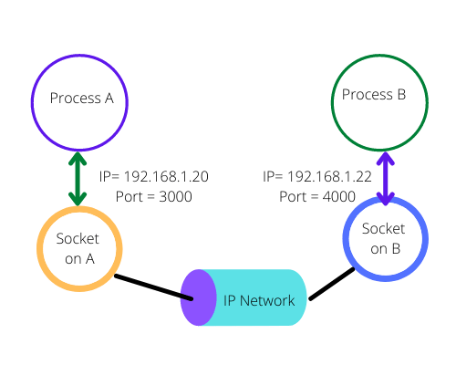
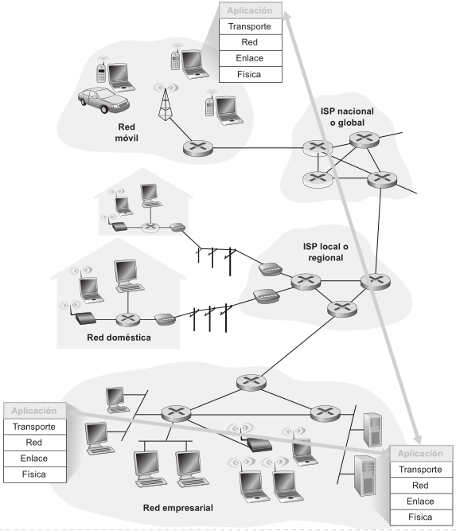

### 2. Si dos procesos deben comunicarse:
<b>a)</b> ¿Cómo podrían hacerlo si están en diferentes máquinas?

Si dos procesos deben comunicarse y están en diferentes máquinas, la forma en que normalmente lo hacen es utilizando <b>sockets</b>. Los sockets proporcionan una interfaz para que los procesos envíen y reciban datos a través de una red. Un proceso actuará como cliente y otro como servidor. El servidor crea un socket y espera conexiones, mientras que el cliente crea un socket e inicia una conexión al servidor utilizando la dirección IP y el número de puerto del servidor. Una vez establecida la conexión, los procesos pueden intercambiar datos.

Un socket es una interfaz de programación de aplicaciones (API) que permite a las aplicaciones comunicarse a través de una red. Se puede considerar como un punto final de una comunicación bidireccional entre dos programas que se ejecuten en una red, ya que sea en la misma máquina o en máquinas diferentes.

Un socket abstrae la complejidad de la comunicación de red subyacente (como los protocolos TCP/IP) y proporciona una interfaz sencilla para enviar y recibir datos.
Cada socket se vincula a una dirección IP específica de la máquina y a un número de puerto en esa máquiina. Esta combinación (IP + Puerto) identifica de manera única un proceso en la red.

<b>Sockets TCP (Orientados a conexión)</b>: Proporcionan una comunicación confiable, ordenada y con detección de errores. Antes de que los datos puedan ser enviados, se debe establecer una conexión (handshake). Son utilizados por protocolos como HTTP, SMTP y FTP.

<b>Sockets UDP (Sin conexión)</b>: Son más simples y rápidos, pero no garantizan la entrega de los datos ni el orden de llegada. Son utilizados por protocolos donde la elocidad es más importante que la fiabilidad, como el streaming de video.

<b>1) Creación:</b> Un proceso crea un socket especificando el tipo de socket (TCP o UDP) y la familia de direcciones (generalmente IPv4 o IPv6).
<b>2) Vinculación (Binding) - Servidor:</b> En el lado del servidor, el socket se vincula a una dirección IP específica de la máquina del servidor y a un número de puerto. Esto permite que los clientes sepan a dónde enviar las solicitudes.
<b>3) Escucha (Listening) - Servidor:</b> El servidor pone el socket en modo de escucha, esperando conexiones entrantes de los clientes. Esto solo se hace para sockets TCP.
<b>4) Conexión (Connecting) - Cliente:</b> El cliente crea el socket y luego intenta conectarse al socket del servidor especificando la dirección IP y el número de puerto del servidor. Para sockets TCP, esto implica el establecimiento de la conexión (handshake).
<b>5) Aceptación (Accepting) - Servidor:</b> Cuando un cliente intenta conectarse, el servidor acepta la conexión. Esto generalmente resulta en la creación de un nuevo socket para la comunicación con ese cliente específico.
<b>6) Envío y Recepción (Sending and Receiving):</b> Una vez establecida la conexión (en el caso de TCP) o sin necesidad de conexión previa (en el caso de UDP), los procesos pueden enviar y recibir datos a través de sus sockets utilizando funciones específicas del sistema operativo.
<b>7) Cierre (Closing):</b> Una vez que la comunicación ha terminado, los procesos cierran sus sockets para liberar los recursos del sistema.

<i>"Los procesos de dos sistemas terminales diferentes se comunican entre ellos intercambiando mensajes a través de la red de computadoras. Un proceso emisor crea y envía mensajes a la red; un proceso receptor recibe estos mensajes y posiblemente responde devolviendo mensajes. La Figura 2.1 ilustra que los procesos se comunican entre sí utilizando la capa de aplicación de la pila de protocolos de cinco capas."</i>

<b>Respuesta del ayudante:</b> La idea del ejercicio también era que mencionen que gracias a los estándares RFC y el protocolo HTTP se pueden comunicar desde distintos sistemas y sistemas operativos sin problema. No está mal la respuesta de los Sockets ya que era una pregunta de investigación, podías irte por cualquier lado.

> Kurose, página 86.

<b>b)</b> Y si están en la misma máquina, ¿qué alternativa existen?

Si los procesos están en la misma máquina, además de usar sockets (a través de la interfaz de loopback), existen alternativas más eficientes para la comunicación entre procesos (IPC).

- <b>Memoria compartida:</b> Permite que dos o más procesos accedan a la misma región de memoria. Esto es muy eficiente ya que evitan la necesidad de copiar datos entre procesos.
- <b>Mensajes (Message passing):</b> Los procesos pueden comunicarse enviando mensajes entre ellos. Esto puede implementarse a través de colas de mensajes o buzones.
- <b>Tuberías (Pipes):</b> Permiten el flujo de datos unidireccional entre procesos relacionados (normalmente un padre y un hijo). Existen las tuberías con nombres (named pipes o FIFOs) que permiten la comunicación entre procesos no relacionados.
- <b>Señales (Signals):</b> Son una forma limitada de comunicación, generalmente utilizada para notificar a un proceso sobre un evento.

<i>"Pero, en este libro, no estamos especialmente interesados en cómo se comunican los procesos que tienen lugar en un mismo host, sino en cómo se comunican los procesos que se ejecutan en hosts diferentes (con sistemas operativos potencialmente diferentes)."</i>

> Kurose, página 86.