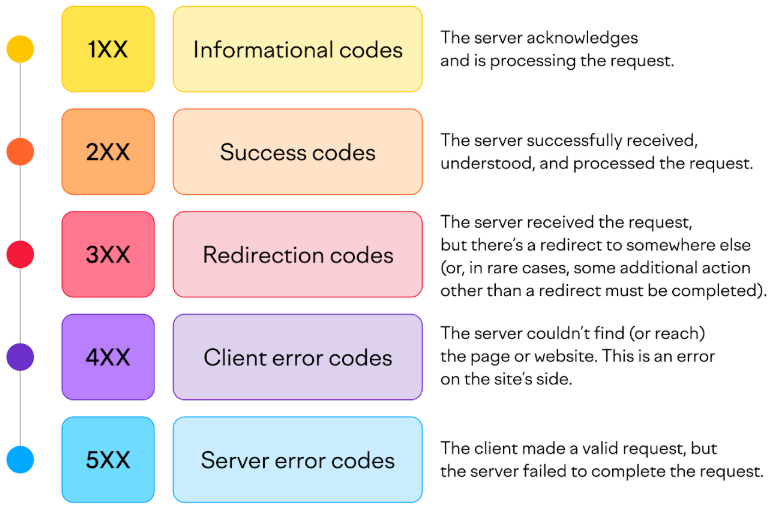

### 12. Investigue los distintos tipos de códigos de retorno de un servidor web y su significado. Considere que los mismos se clasifican en categorías (2XX, 3XX, 4XX, 5XX).

Los códigos de retorno HTTP son respuestas numéricas de tres dígitos que un servidor web envía en respuesta a una solicitud de un cliente. Estos códigos indican el resultado de la solicitud y se clasifican en cinco categorías principales, según el primer dígito:

Códigos de retorno más comunes

