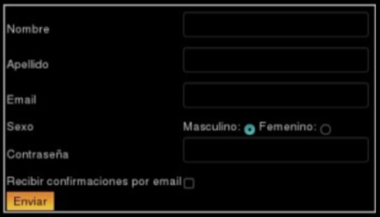

### 17. En el siguiente ejercicio veremos la diferencia entre los métodos POST y GET. Para ello, será necesario utilizar la VM y la herramienta Wireshark. Antes de iniciar sesión considere:

- Capture los paquetes utilizando la interfaz con IP 172.28.0.1. (Menú: Capture -> Options. Luego seleccione la interfaz correspondiente y presione Start).

- Para que el analizador de red sólo nos muestre los mensajes del protocolo http introduciremos la cadena 'http' (sin las comillas) en la ventana de especificación de filtros de visualización (display-filter). Si no hiciéramos esto veríamos todo el tráfico que es capaz de capturar nuestra placa de red. De los paquetes que son capturados, aquel que esté seleccionado será mostrado en forma detallada en la sección que está justo debajo. Como sólo estamos interesados en http, ocultaremos toda la información que no es relevante para esta práctica (Información de trama, toda la información, IP y TCP). Desplegar la información correspondiente al protocolo HTTP bajo la leyenda 'Hypertext Transfer Protocol".

- En caso de querer ver de forma simplificada el contenido de una comunicación http, utilice el botón derecho sobre un paquete HTTP perteneciente al flujo capturado y seleccione la opción "Follow TCP Stream".

a) Abra un navegador e ingrese a la URL: www.redes.unlp.edu.ar e ingrese al link en la sección "Capa de Aplicación" llamado "Métodos HTTP". En la página mostrada se visualizan dos nuevos links llamados: Método GET y Método POST. Ambos muestran un formulario como el siguiente:



b) Analice el código HTML.

c) Utilizando el analizador de paquetes Wireshark capture los paquetes enviados y recibidos al presionar el botón "Enviar".


d) ¿Qué diferencias detectó en los mensajes enviados por el cliente?

e) ¿Observó alguna diferencia en el browser si se utiliza un mensaje u otro?

URL utilizando GET:

```
http://www.redes.unlp.edu.ar/http/metodos-lectura-valores.php?form_nombre=Leo&form_apellido=Luna&form_mail=leo%40gmail.com&form_sexo=sexo_masc&form_pass=pepe
```

URL utilizando POST:

```
http://www.redes.unlp.edu.ar/http/metodos-lectura-valores.php
```