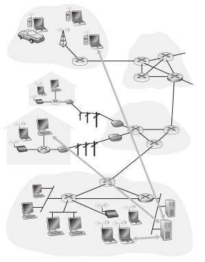

### 3. Explique brevemente cómo es el modelo Cliente/Servidor. Dé un ejemplo de un sistema Cliente/Servidor en la "vida cotidiana" y un ejemplo de un sistema informático que siga el modelo Cliente/Servidor. ¿Conoce algún otro modelo de comunicación?

En una arquitectura cliente-servidor siempre existe un host activo, denominado servidor, que da servicio a las solicitudes de muchos otros hosts, que son los clientes. Los hosts clientes pueden estar activos siempre o de forma intermitente. Un ejemplo clásico es la Web en la que un servidor web siempre activo sirvee las solicitudes de los navegadores que se ejecutan en los hosts clientes. Cuando un servidor web recibe una solicitud de un objeto de un host cliente, responde enviándole el objeto solicitado. Con la arquitectura cliente-servidor es que el servidor tiene una dirección fija y conocida, denominada dirección IP (de la que hablaremos enseguida). Puesto que el servidor puede contactar con él enviando un paquete a su dirección. Entre las aplicaciones más conocidas que utilizan la arquitectura cliente-servidor se encuentran las aplicaciones web, FTP, Telnet y de correo electrónico.

<i>Arquitectura Cliente-Servidor</i>

Normalmente, en una aplicación Cliente-Servidor un único host servidor es incapaz de responder a todas las solicitudes de sus clientes. Por ejemplo, el sitio de una red social popular puede ver rápidamente desbordado si sólo dispone de un servidor para gestionar todas las solicitudes. Por esta razón, en las arquitecturas cliente-servidor suele utilizarse una agrupación (Clusters) de hosts, que a veces se denomina centro de datos, para crear un servidor virtual de gran capacidad. Los servicios de aplicaciones basadas en una arquitectura cliente-servidor a menudo precisan una infraestructura intensiva, ya que requieren que los proveedores de servicios compren, instalen y mantengan granjas de servidores.