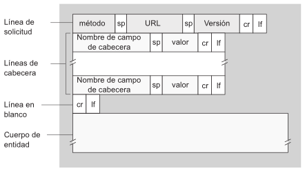

### 4. Describa la funcionalidad de la entidad genérica "Agente de usuario" o "User Agent".

#### Mensaje de solicitud HTTP típico

```
GET /unadireccion/pagina.html HTTP/1.1
Host: www.unaescuela.edu
Connection: close
User-agent: Mozilla/4.0
Accept-language: fr
```

En primer lugar, se puede notar que el mensaje está escrito en texto ASCII, por lo que cualquier persona con conocimientos informáticos puede leerlo.
En segundo lugar, el mensaje consta de cinco líneas, cada una de ellas seguida por un retorno de carro y un salto de línea. La última línea va seguida de un retorno de carro y un salto de línea adicionales. Aunque este mensaje en concreto está formado por cinco líneas, un mensaje de solicitud puede constar de muchas más líneas o tener tan pocas como únicamente una. La primera línea de un mensaje de una solicitud HTTP se denomina <b>línea de solicitud</b> y las siguientes líneas son las <b>líneas de cabecera</b>. La línea de solicitud consta de tres campos:

- <b>El campo de método</b>
- <b>El campo URL</b>
- <b>El campo de la versión HTTP</b>

El campo que especifica el método puede tomar diferentes valores, entre los que se incluyen GET, POST, HEAD, PUT y DELETE. La inmensa mayoría de los mensajes de solicitud HTTP utilizan el método GET. Este método se emplea cuando el navegador solicita un objeto, identificando dicho objeto en el campo URL. En el el mensaje de ejemplo se está solicitando el objeto ```/unadireccion/pagina.html```. El campo correspondiente a la versión se explica por sí mismo: En este ejemplo, el navegador utiliza la versión ```HTTP/1.1```.
La línea de cabecera ```Host: www.unaescuela.edu``` especifica el host en el que reside el objeto. Podría pensarse que esta línea es innecesaria ya que se cuenta con una conexión TCP activa con el Host, pero las cachés proxy web necesitan la información proporcionada por la línea de cabecera del Host.
Al incluir la línea de cabecera ```Connection: close```, el navegador está diciendo al servidor que no desea molestarse en trabajar con conexiones persistentes, sino que desea que el servidor cierre la conexión después de enviar el objeto solicitado.
La línea de cabecera ```User-agent: Mozilla/4.0``` especifica el agente de usuario, es decir, el tipo de navegador que está haciendo la solicitud al servidor. Esta línea resulta útil porque el servidor puede enviar versiones diferentes del mismo objeto a los distintos tipos de agentes de usuario (en el mismo URL direcciona a cada una de las versiones).
Por último, la línea de cabecera ```Accept-language: fr``` indica que el usuario prefiere recibir una versión en francés del objeto, si tal objeto existe en el servidor; en caso contrario, el servidor enviará la versión por defectos.

