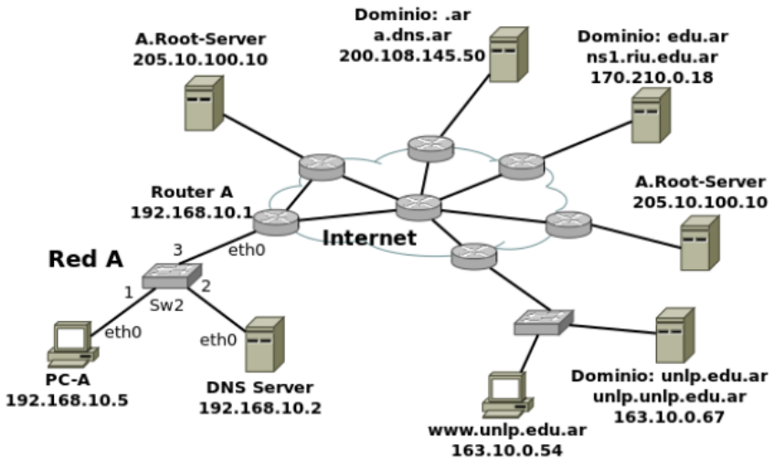

### 17. Observar el siguiente gráfico y contestar:



<b>a.</b> Si la PC-A, que usa como servidor DNS a "DNS Server", desea obtener la IP de ```www.unlp.edu.ar```, cuáles sería, y en qué orden, los pasos que se ejecutarán para obtener esta respuesta.

<b>1)</b> Revisar el archivo de hosts locales para ver si lo tiene mapeado manualmente.
<b>2)</b> En caso de no estar, le consulta a su servidor DNS por la IP del dominio y este la busca en su caché.
<b>3)</b> En caso de no estar, le consultará al root server por el TLD (```.ar```).
<b>4)</b> Luego le consultará al TLD por la zona ```edu```.
<b>5)</b> A la zona ```edu``` le consultará por la subzona ```unlp```.
<b>6)</b> Una vez dentro de la zona ```unlp.edu.ar```, consultará por el registro A del dominio ```www.unlp.edu.ar``` y devolverá la respuesta.

<b>b.</b> ¿Dónde es recursiva la consulta? ¿Y dónde iterativa?

La consulta recursiva se la hace PC-A al servidor DNS, las iterativas las realiza DNS Server a todos los servidores necesarios para llegar a la respuesta.