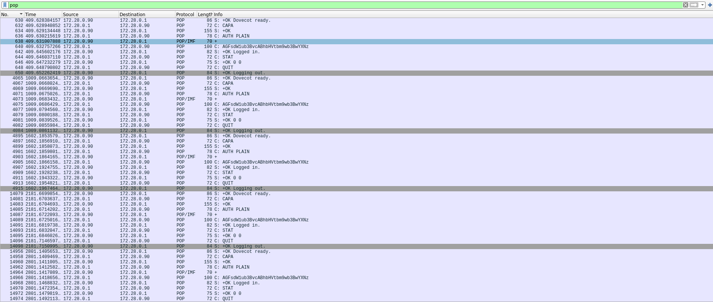

### 4. Análisis del protocolo POP3

<b>a.</b> Utilizando Wireshark, capture el tráfico de red contra el servidor de correo mientras desde la cuenta ```alumnoimap@redes.unlp.edu.ar``` le envía un correo a ```alumnopop@redes.unlp.edu.ar``` y mientras ```alumnopop@redes.unlp.edu.ar``` recepciona dicho correo.

<b>b.</b> Utilice el filtro POP para observar los paquetes del protocolo POP en la captura generada y analice el intercambio de dicho protocolo entre el cliente y el servidor para observar los distintos comandos utilizados y su correspondiente respuesta.



No tengo ni idea de qué es lo que debería estar viendo acá como para poder "responder" a la pregunta.