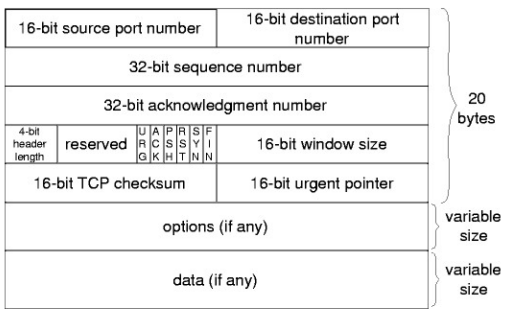
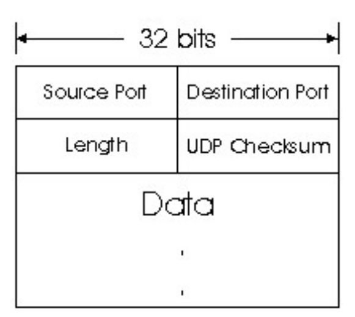

### 2. Describa la estructura del segmento TCP y UDP.

#### Segmento TCP

Un segmento TCP encapsula los datos de la capa de aplicación para su transmisión. Su estructura general consiste en un encabezado seguido de la sección de datos (payload). El encabezado tiene una longitud variable, entre 20 y 60 bytes, debido a un campo de opciopnes opciopnal.

- <b> Puerto Origen (16 bits):</b> Puerto de la aplicación que envía el segmento.
- <b> Puerto Destino (16 bits):</b> Puerto de la aplicación destino que recibirá el segmento. 
- <b> Número de Secuencia (32 bits):</b> Número del primer byte de datos en este segmento. Se utiliza para reensamblar los datos en el orden correcto en el destino.
- <b> Número de Acknowledgement de Recibo (32 bits):</b> Número del siguiente byte que el receptor espera recibir. Indica que todos los bytes anteriores han sido recibidos correctamente (si el flag ACK está activado).
- <b> Longitud del Encabezado (Data Offset) (4 bits):</b> Indica la longitud del encabezado TCP en palabras de 4 bytes. Esto determina dónde comienzan los datos.
- <b>Reservado (6 bits):</b> Bits reservados para uso futuro (generalmente son cero).
- <b>Flags (o Bits de Control) (6 bits):</b> Varios bits de 1 bit que indican condiciones o propósitos especiales del segmento:
    - `URG`: El campo _Puntero Urgente_ es válido.
    - `ACK`: El campo _Número de Acknowledgement de Recibo_ es válido.
    - `PSH`: Indica que los datos deben ser entregados a la aplicación receptora inmediatamente.
    - `RST`: Reestablece la conexión TCP.
    - `SYN`: Sincroniza los números de secuencia durante el establecimiento de la conexión.
    - `FIN`: Indica que el emisor ha terminado de enviar datos y desea cerrar la conexión.

- <b> Ventana (16 bits):</b> Indica el número de bytes que el receptor está dispuesto a aceptar. Se utiliza para el control de flujo.
- <b> Checksum (16 bits):</b> Suma de verificación para detectar errores en el encabezado y los datos.
- <b> Puntero Urgente (16 bits):</b> Indica el final de los datos urgentes dentro del segmento (solo válido si el flag URG está activado).
- <b> Opciones (0-320 bits):</b> Campos opcionales que proporcionan funcionalidades adicionales (ej. tamaño máximo del segmento).
- <b> Relleno (variable):</b> Se utiliza para asegurar que el encabezado TCP termine en un límite de palabra de 32 bits.
- <b> Datos (Payload) (variable):</b> Los datos reales de la capa de aplicación que se están transmitiendo.

#### Segmento UDP

El segmento UDP tiene una estructura mucho más simple y un encabezado de tamaño fijo de 8 bytes. Esta simplicidad es una de las razones por las que UDP es más rápido pero menos confiable que TCP.

- <b> Puerto Origen (16 bits):</b> Puerto de la aplicación que envía el datagrama. Este campo es opcional; si no se utiliza, se establece en 0.
- <b> Puerto Destino (16 bits):</b> Puerto de la aplicación destino que recibirá el datagrama.
- <b> Longitud (16 bits):</b> Longitud total del datagrama UDP en btyes, incluyendo el encabezado y los datos. La longitud mínima es de 8 bytes (solo el encabezado).
- <b> Checksum (16 bits):</b> Suma de verificación opcional para detectar errores en el encabezado y los datos. Si no se utiliza, se establece en 0.
- <b> Datos (payload) (variable):</b> Los datos de la capa de aplicación que se están transmitiendo.

TCP proporciona una transferencia de datos confiable y orientada a la conexión con un encabezado más complejo, mientras que UDP ofrece una transferencia de datos no confiable y sin conexión con un encabezado mucho más pequeño y sumple. La elección entre TCP y UDP depende de los requisitos específicos de la aplicación.