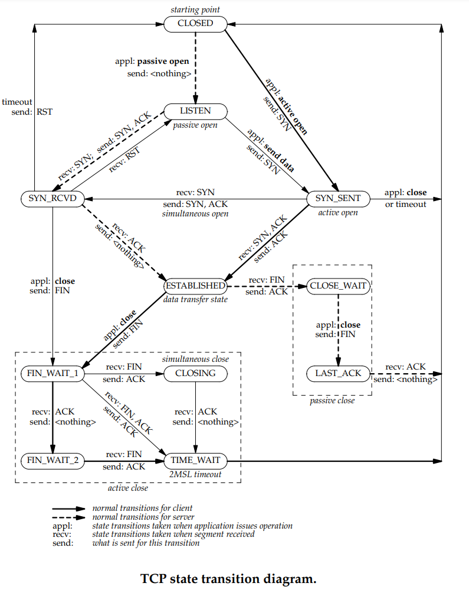

### 12. Investigue los distintos tipos de estado que puede tener una conexión TCP. Ver [Diagrama de Transición de Estados TCP](https://users.cs.northwestern.edu/~agupta/cs340/project2/TCPIP_State_Transition_Diagram.pdf)

Una conexión progresa a través de una serie de estados durante su vida útil. Los estados son: LISTEN, SYN-SENT, SYN-RECEIVED, ESTABLISHED, FIN-WAIT-1, FIN-WAIT-2, CLOSE-WAIT, CLOSING, LAST-ACK, TIME-WAIT, y el estado ficticio CLOSED. CLOSED es ficticio porque representa el estado en el que no hay TCB (Bloque de Control de Transmisión), y por lo tanto, no hay conexión. Brevemente, los significados de los estados son:

**LISTEN**: representa la espera de una solicitud de conexión de cualquier TCP remoto y puerto.

**SYN-SENT**: representa la espera de una solicitud de conexión coincidente después de haber enviado una solicitud de conexión.

**SYN-RECEIVED**: representa la espera de una confirmación de reconocimiento de solicitud de conexión después de haber recibido y enviado una solicitud de conexión.

**ESTABLISHED**: representa una conexión abierta; los datos recibidos pueden ser entregados al usuario. Es el estado normal para la fase de transferencia de datos de la conexión. ***(Es la única conexión que representa una conexión establecida (para la cátedra)).***

**FIN-WAIT-1**: representa la espera de una solicitud de terminación de conexión del TCP remoto, o un reconocimiento de la solicitud de terminación de conexión enviada previamente.

**FIN-WAIT-2**: representa la espera de una solicitud de terminación de conexión del TCP remoto.

**CLOSE-WAIT**: representa la espera de una solicitud de terminación de conexión del usuario local. 

**CLOSING**: representa la espera de un reconocimiento de solicitud de terminación de conexión del TCP remoto.

**LAST-ACK**: representa la espera de un reconocimiento de la solicitud de terminación de conexión enviada previamente al TCP remoto (que incluye un reconocimiento de su solicitud de terminación de conexión).

**TIME-WAIT**: representa la espera de tiempo suficiente para asegurarse de que el TCP remoto recibió el reconocimiento de su solicitud de terminación de conexión.

**CLOSED**: representa que no hay ningún estado de conexión en absoluto.

Una conexión TCP progresa de un estado a otro en respuesta a eventos. Los eventos son las llamadas de usuario (OPEN, SEND, RECEIVE, CLOSE, ABORT y STATUS); los segmentos entrantes, particularmente aquellos que contienen los flags SYN, ACK, RST y FIN; y los tiempos de espera (timeouts).

