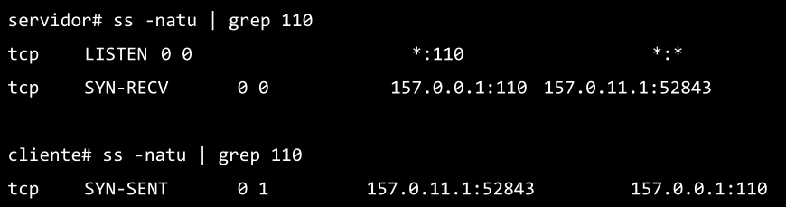

### 14. Dadas las salidas de los siguientes comandos ejecutados en el cliente y el servidor, responder:

**Consulta: Por qué pide el UDP si sólo hay TCP? Porque sí o hay algo que me estoy perdiendo?**

**a.** ¿Qué segmentos llegaron y cuáles se están perdiendo en la red?

Está llegando el segmento es el "SYN" del cliente al servidor para iniciar el 3-Way Handshake.
El segmento perdido es el "SYN-ACK" del servidor al cliente (paso 2 del 3-Way Handshake).

**b.** ¿A qué protocolo de capa de aplicación y de transporte se está intentando conectar el cliente?

POP3.

**c.** ¿Qué flags tendría seteado el segmento perdido?

SYN-ACK.