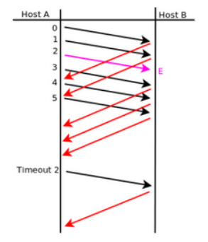

### 4. Suponiendo Selective Repeat; tamaño de ventana 4 y sabiendo que E indica que el mensaje llegó con errores. Indique en el siguiente gráfico, la numeración de los ACK que el host B envía al host A.



Primero una definición de Selective Repeat, porque salió el concepto de la nada (no voy a las teorías, no leo las diapositivas, no leo el libro ni veo los videos :D): Selective Repeat es un protocolo de control de errores usado en redes de computadoras para asegurar la entrega confiable de paquetes de datos. Es una de las implementaciones del Protocolo de Ventana Deslizante (Sliding Window Protocol).

A diferencia de otros protocolos como "Go-Back-N", este **solo** retransmite los paquetes que se han perdido o dañado.

- Ventanas de Envío y Recepción: Tanto el remitente como el receptor mantienen una "ventana" de paquetes

    - Remitente: Define un rango de números de secuencia de los paquetes que el remitente puede enviar sin esperar un ACK individual.
    - Receptor: Define el rango de números de secuencia de los paquetes que el receptor está dispuesto a aceptar. La lave está en el que el receptor puede aceptar y almacenar paquetes fuera de orden, siempre y cuando estén dentro de su ventana.

>Como mi cerebro lo entiende:
>
>El receptor define una ventana en secuencia, ej. [1,2,3,4], donde puede recibir paquetes dentro de esa ventana fuera de orden, y notifica que lo recibió, o puede recibir en orden, donde también notifica que lo recibió y mueve la ventana, dejándola en [2,3,4,5].
>Si se le envía algún paquete fuera de la ventana, este se descarta y envía un NACK, también envía un NACK en caso de faltarle alguno de los paquetes de la ventana.

- Numeración de Secuencia: Cada paquete de datos tiene un número de secuencia único.

- ACKs y NACKs (Negative ACK)

    - Cuando el receptor recibe un paquete correctamente, envía un ACK para ese paquete específico.
    - Si el receptor detecta un paquete perdido o dañado puede enviar un NACK para ese paquete en particular.

- Retransmisión Selectiva:

    - El remitente mantiene un temporizador para cada paquete enviado.
    - Si el remitente no recibe un ACK para un paquete dentro de un período de tiempo determinado (timeout), o si recibe un NACK, retransmite **solo ese paquete** específico. No necesita retransmitir todos los paquetes posteriores al perdido.

- Reordenamiento en el Receptor: Como el receptor puede recibir paquetes fuera de orden, debe tener la capacidad de almacenarlos en un buffer y después reordenarlos para entregarlos a la capa superior de la aplicación en el orden correcto.

>**Lo mismo, mi entendimiento:**
>
>Soy el remitente, puedo enviar hasta X paquetes sin haber recibido un ACK por ellos. Si envié X paquetes y no recibí ningún ACK para mover/deslizar mi ventana, freno el envío de nuevos paquetes hasta que el receptor envíe un ACK que libere espacio en mi ventana de envío.
>
>Dejando de fingir demencia con un cambio de personalidad al remitente:
>
>Si el remitente envió los paquetes 1, 2, 3, 4 (ventana [1,2,3,4]) y no recibió ningún ACK, no puede enviar el paquete 5 hasta que llegue un ACK para el paquete 1. Acá es cuando el remitente frena el envío de **nuevos paquetes** (nótese el énfasis, porque puede seguir enviando los ya enviados) que estén fuera de su ventana actual. No obstante (re formal 🤓), sigue monitoreando y retransmitiendo los paquetes dentro de su ventana si sus temporizadores expiran o recibe un NACK.
>
>El temporizador es individual (por paquete) y se inicializa cuando son enviados, cuando un temporizador vence, retransmite el paquete correspondiente.
>
>Ahora soy el receptor 📪, supongamos que mi ventana de recepción es [5,6,7,8], estoy esperando el paquete 5 como el siguiente en orden, hay varios posibles escenarios:
>
>1) Espero el 5 y recibo el 5, envío un ACK para 5 y lo entrego a la aplicación (capa superior), como ya tengo el que esperaba en orden, deslizo mi ventana a [6,7,8,9].
>2) Espero el 5 y recibo el 7, como el 7 está dentro de mi ventana, lo acepto, lo almaceno en el buffer y envío un ACK para 7.
>3) Espero el 5 y recibo el 10, no está dentro de mi ventana, por lo tanto lo considero inválido y lo descarto.
>4) Tengo el 5, 7 y 8, puedo enviar un NACK para indicar que me falta el 6.
>5) Espero el 5 y recibo el 5, pero este vino corrupto, es decir, no pasa la prueba del checksum, lo descarto y no envío un ACK. Me será retransmitido en caso de que venza su temporizador o reciba otro paquete fuera de orden y envíe un NACK para el 5.
>
>**Datazo importante:** El tamaño de la ventana de envío y recepción debe ser el mismo (o la ventana del receptor un poco más grande en algunas implementaciones específicas).


ENTONCES, retomando el ejercicio (el ayudante en su cabeza: "la puta madre pendejo de mierda, consultá algo de la materia", probably):

Según entiendo lo que pasa es:

Tamaño de ventana 4, podríamos decir que es [1,2,3,4]

```ruby
Host A: Envía 1
Host B: 1 - ACK
Deslizamiento de ventana [2,3,4,5]
Host A: Envía 2
Host B: 2 - ACK
Deslizamiento de ventana [3,4,5,6]
Host A: Envía 3 [FALLA]
Host A: Envía 4
Host B: 4 - ACK
Host A: Envía 5
Host B: 5 - ACK
Host A: Envía 6
Host B: 6 - ACK

[TIMEOUT]

Host A: Retransmite 3
Host B: 3 - ACK
```

En mi cabeza tiene todo el sentido 🤠 