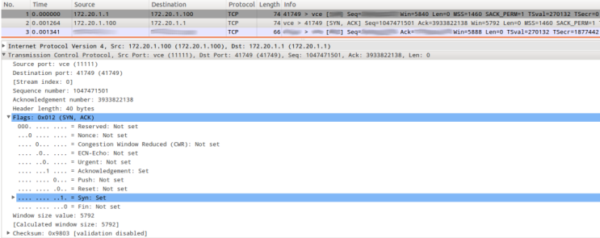

### 6. De acuerdo a la captura TCP de la siguiente figura, indique los valores de los campos borroneados.

2^(m−1)
Primera línea:
[SYN] Seq=[3933822212]

Tercera línea:
[172.20.1.1] [172.20.1.100] [41749] > [vce] [ACK] Seq=[] Ack=[]

Honestamente no entendí nada, lo mismo con el ejercicio 7 :

**Comentario del ayudante para poder resolverlo:** Mirá la línea donde está desplegado, con la flechita apuntando hacia abajo.