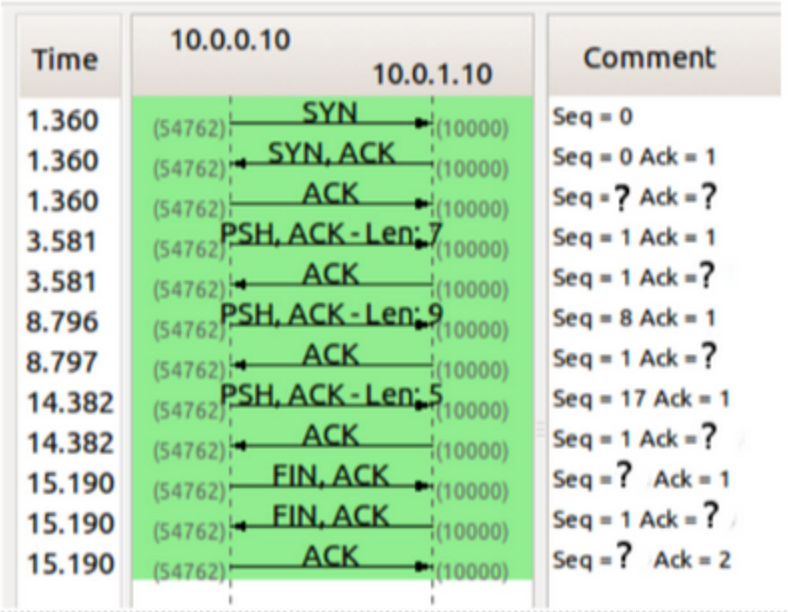

### 7. Dada la sesión TCP de la figura, completar los valores marcados con un signo de interrogación.

**Comentario del ayudante:** Literalmente lo expuse este ejercicio, debería estar subida la explicacioón.