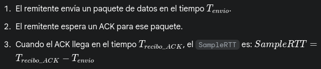
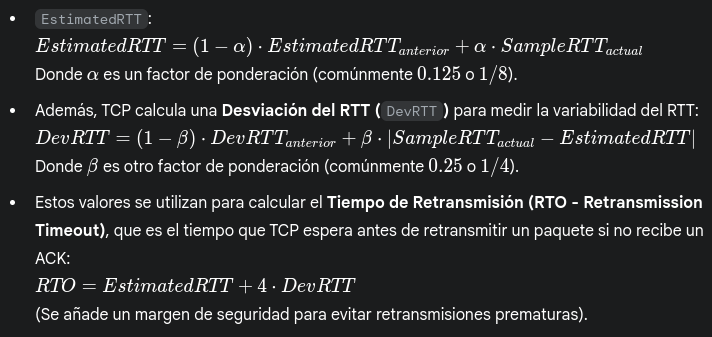

### 8. ¿Qué es el RTT y cómo se calcula? Investigue la opción TCP timestamp y los campos TSval y TSecr.

RTT = Round Trip Time (Tiempo de Ida y Vuelta): Es una métrica fundamental en redes que mide la cantidad de tiempo que tarda un paquete en ir desde un punto de origen hasta un destino y volver al origen, incluyendo el tiempo de procesamiento en el destino (se mide en milisegundos).

En TCP, el RTT se calcula de forma dinámica y adaptativa, ya que las condiciones de la red pueden cambiar constantemente. Cada host que envía datos es responsable de estimar el RTT a su destino.

La forma básica de medir un SampleRTT es (y acá es donde entra Gemini porque yo no sé sumar):

Sin embargo, TCP no usa simplemente el último SampleRTT. Utiliza un algoritmo de media móvil exponencial ponderada para calcular un EstimatedRTT, que es más suave y representa mejor las condiciones de la red a largo plazo. El algoritmo más conocido es el Jacobson/Karn.

**Opción TCP TimeStamp y campos TSval y TSecr:**

La opción TCP TimeStamp (RFC 1323) es una extensión del encabezado TCP que mejora la precisión del cálculo de RTT y ayuda a proteger contra números de secuencia "envueltos" (PAWS - Protection Against Wrapped Sequence numbers) en conexiones de alta velocidad.

**1. TSval (Timestamp Value):**

    - Contiene el valor actual del reloj de timestamp del host que está enviando el segmento TCP.
    - Este reloj incrementa a una velocidad definida por el sistema operativo.
    - Es como la hora de envío interna del host para ese paquete.

**2. TSecr (Timestamp Echo Reply):**

    - Contiene un eco del último TSval recibido del host remoto.
    - Este campo solo es válido si el bit de ACK está configurado en el encabezado TCP (ya que está "reconociendo" un timestamp recibido). Si el bit de ACK no está configurado, su valor debe ser 0.

>[!note]
>Para mi pobre cerebro, nada de lo que dice arriba tiene sentido.

**Comentario del ayudante**: En la práctica no vemos absolutamente nada de todo esto.