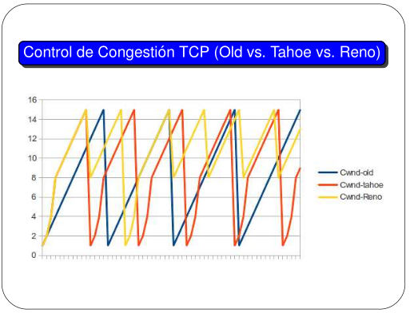

### 11. Responda las siguientes preguntas respecto del mecanismo de control de congestión.

**a.** ¿Quién activa el mecanismo de control de congestión? ¿Cuáles son los posibles disparadores?

A diferencia del control de flujo, este mecanismo es activado y gestionado (principalmente) por el remitente (host que envía datos). Este se encarga de monitorear las señales de congestión en la red.

Disparadores:

**1) Pérdida de paquetes (Timeout):** Cuando un remitente no recibe un ACK para un segmento enviado dentro de un tiempo (RTO - Retransmission Timeout), asume que el paquete se perdió debido a la congestión de la red.

**2) Triple ACK Duplicado (Fast Retransmit/Fast Recovery):** Cuando el remitente recibe tres ACKs duplicados consecutivos para el mismo segmento (indicando que el receptor ha recibido segmentos fuera de orden, pero el segmento esperado no ha llegado), es una señal menos grave pero aún significativa de que un segmento se ha perdido en la red. Esto sugiere que el paquete se perdió, pero que otros paquetes posteriores si están llegando, lo que indica que la congestión es menor severa que un timeuot.

>^ yo lo entiendo como que espero un paquete, me llega uno random y mando un ACK como diciendo "che, recibí algo pero no era lo que esperaba", entonces cuando esto se cumple 3 veces, es que se dio el triple ACK duplicado. (tiene sentido?)

**Comentario del ayudante:** En realidad mandás el ACK original del paquete, y, si ves que necesitás dar señal de que se perdió algo, mandás 3 más, terminan siendo 4 en total.

**3) Explicit Congestion Notification (ECN):** Algunos routers pueden marcar los paquetes TCP con un bit en el encabezado IP cuando detectan una cola a punto de llenarse, antes de tener que descartar paquetes. Si el receptor recibe un paquete con esta marca, envía un ACK al remitente con una notificación de ECN-Echo. Esta es una señal temprana de congestión, que permite al remitente reducir su tasa de envío de forma proactiva, evitando pérdidas.

>^ me suena que este no lo vemos, nunca había escuchado a alguien mencionarlo. 

**Comentario del ayudante:** En  la teoría nomás.

**b.** ¿Qué problema resuelve?

Cuando la cantidad de datos que los hosts inyectan en la red excede la capacidad de la red para reenviarlos.

Si varios remitentes intentan enviar datos a la máxima velocidad posible, los routers intermedios se sobrecargarán. Sus buffers se llenarán y comenzarán a descartar paquetes masivamente. Estos descartes llevan a retransmisiones (por timeout o ACKs duplicados),.

**c.** Diferencie slow start de congestion-avoidance.

Ambas son fases principales del algoritmo de congestión de TCP, cada una con un propósito y comportamiento distinto. Ambas fases operan aumentando el tamaño de la ventana de congestión (cwnd), que es la cantidad máxima de datos que el remitente puede tener en tránsito en la red en un momento dado.

**Slow Start:** Este es el estado inicial de una conexión TCP (o cuando se detecta un timeout). Su objetivo es explorar rápidamente la capacidad de la red de manera conservadora, pero con un crecimiento exponencial, hasta encontrar el punto donde podría empezar la congestión.

- **Comportamiento:**

    - La cwnd empieza con un valor bajo (típicamente 1 o 2 MSS (Maximum Segment Size)).
    - Por cada ACK recibido, la cwnd se incrementa en 1 MSS.
    - Esto quiere decir que la cwnd crece exponencialmente. Ej. si se empieza con 1 MSS y enviás un paquete, cuando recibís el ACK, cwnd se vuelve 2 MSS. Enviás 2 paquetes, recibís 2 ACKs, cwnd se vuelve 4 MSS, y así sucesivamente.

- **Finalización/Transición:** Slow Start continúa hasta que

    - Se detecta una pérdida de paquete (Timeout o Triple ACK Duplicado).
    - La cwnd alcanza un límite predefinido llamado "slow start threshold" (sstresh). Cuando cwnd >= sstresh, TCP transita a la fase de Congestión Avoidance.

**Congestion Avoidance:** Una vez que TCP exploró la capacidad de la red (o se recuperó de una congestión y redujo su cwnd), esta fase busca aumentar la tasa de envío de la manera más conservadora y lineal, para evitar volver a causar congestión.

- **Comportamiento:**

    - Cuando TCP entra en Congestion Avoidance, la cwnd incrementa linealmente.
    - Por cada RTT, la cwnd se incrementa en 1 MSS.
    - Esto quiere decir que la cwnd se incrementa en 1 MSS por cada ventana completada de datos que es reconocida. Ej. si cwnd es 10 MSS, enviarías 10 paquetes. Cuando recibas todos los 10 ACKs, la cwnd se convierte en 11 MSS.

- **Finalización/Transición:** Congestion Avoidance continúa hasta que

    - Se detecta una pérdida de paquete (again, timeout o triple ack duplicados). En este caso, TCP vuelve a la fase de Slow Start (o Fast Recovery si es un triple ack duplicado).

>[!note]
>Según mi leve y vaga investigación, ambos TCP Tahoe y TCP Reno implementan los conceptos de Slow Start y Congestion Avoidance de distinta manera, TCP Reno es más eficiente y agrega el mecanismo Fast Retransmit y Fast Recovery.

**Comentario del ayudante:** Esto es super fino hasta para teoría. Que te lo pueden tomar en teoría, pero en la práctica ni ahí.

#### Diferencias Clave: Slow Start vs. Congestion Avoidance

| Característica        | Slow Start (Inicio Lento)                                | Congestion Avoidance (Evitación de Congestión)           |
| :-------------------- | :------------------------------------------------------- | :------------------------------------------------------- |
| **Propósito Principal** | Explorar rápidamente el ancho de banda disponible de la red después de una conexión nueva o un timeout. | Aumentar la tasa de envío de forma cautelosa para evitar sobrecargar la red, una vez que se ha estimado la capacidad. |
| **Crecimiento de `cwnd` (Ventana de Congestión)** | **Exponencial.** `cwnd` aumenta en 1 MSS por cada ACK recibido. Por cada RTT, `cwnd` se duplica. | **Lineal.** `cwnd` aumenta en 1 MSS por cada RTT (o proporcionalmente por cada ACK recibido, sumando 1 MSS por cada ventana completa de ACKs). |
| **Punto de Inicio** | Al comienzo de una nueva conexión TCP (primera vez). Después de un timeout de retransmisión (pérdida severa). | Cuando `cwnd` alcanza el `ssthresh` (slow start threshold). Después de un Fast Retransmit/Fast Recovery. |
| **Umbral (`ssthresh`)** | Es el valor que la `cwnd` debe alcanzar para pasar a Congestion Avoidance. Se establece a la mitad de `cwnd` cuando ocurre una pérdida. | Se utiliza como el umbral donde comienza esta fase (es el `cwnd` actual o la mitad de `cwnd` si viene de Fast Retransmit). |
| **Agresividad** | **Más agresivo** en el aumento de la tasa de envío, para "saltar" rápidamente a un buen punto de operación. | **Menos agresivo**, crecimiento más conservador y constante para sondear la capacidad sin causar congestión. |
| **Salida de la Fase** | Al alcanzar `ssthresh` (transición a Congestion Avoidance) o al detectar una pérdida (Timeout o Triple ACK Duplicado). | Al detectar una pérdida de paquete (Timeout o Triple ACK Duplicado). |

**Comentario del ayudante:** De la tabla entera, no vemos nada en la práctica.